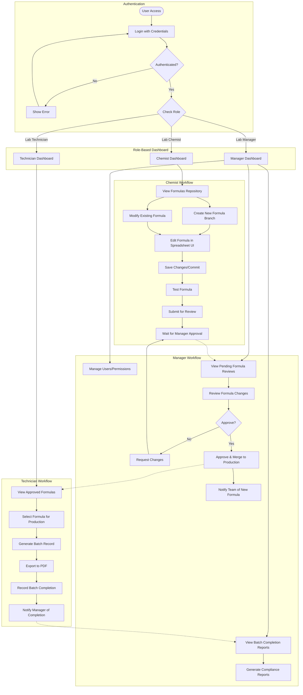

```mermaid
flowchart TB
    subgraph "Authentication"
        Start([User Access]) --> Login[Login with Credentials]
        Login --> AuthCheck{Authenticated?}
        AuthCheck -->|No| LoginError[Show Error]
        LoginError --> Login
        AuthCheck -->|Yes| RoleCheck{Check Role}
    end

    subgraph "Role-Based Dashboard"
        RoleCheck -->|Lab Chemist| ChemistDash[Chemist Dashboard]
        RoleCheck -->|Lab Technician| TechDash[Technician Dashboard]
        RoleCheck -->|Lab Manager| ManagerDash[Manager Dashboard]
    end

    %% Lab Chemist Flow
    subgraph "Chemist Workflow"
        ChemistDash --> ViewFormulas[View Formulas Repository]
        ViewFormulas --> CreateBranch[Create New Formula Branch]
        ViewFormulas --> ModifyExisting[Modify Existing Formula]
        
        CreateBranch --> FormulaEdit[Edit Formula in Spreadsheet UI]
        ModifyExisting --> FormulaEdit
        
        FormulaEdit --> SaveChanges[Save Changes/Commit]
        SaveChanges --> TestFormula[Test Formula]
        TestFormula --> SubmitPR[Submit for Review]
        SubmitPR --> WaitApproval[Wait for Manager Approval]
    end
    
    %% Lab Technician Flow
    subgraph "Technician Workflow"
        TechDash --> TechViewFormulas[View Approved Formulas]
        TechViewFormulas --> SelectFormula[Select Formula for Production]
        SelectFormula --> GenerateBatchRecord[Generate Batch Record]
        GenerateBatchRecord --> ExportPDF[Export to PDF]
        ExportPDF --> RecordCompletion[Record Batch Completion]
        RecordCompletion --> NotifyComplete[Notify Manager of Completion]
    end
    
    %% Lab Manager Flow
    subgraph "Manager Workflow"
        ManagerDash --> ManageUsers[Manage Users/Permissions]
        ManagerDash --> ViewPendingPRs[View Pending Formula Reviews]
        ManagerDash --> CompletionReports[View Batch Completion Reports]
        
        ViewPendingPRs --> ReviewChanges[Review Formula Changes]
        ReviewChanges --> ApprovalDecision{Approve?}
        
        ApprovalDecision -->|No| RequestChanges[Request Changes]
        RequestChanges --> WaitApproval
        
        ApprovalDecision -->|Yes| ApproveChanges[Approve & Merge to Production]
        ApproveChanges --> NotifyTeam[Notify Team of New Formula]
        
        CompletionReports --> GenerateReports[Generate Compliance Reports]
    end
    
    %% Cross-workflow connections
    WaitApproval -.-> ViewPendingPRs
    ApproveChanges -.-> TechViewFormulas
    NotifyComplete -.-> CompletionReports
```

